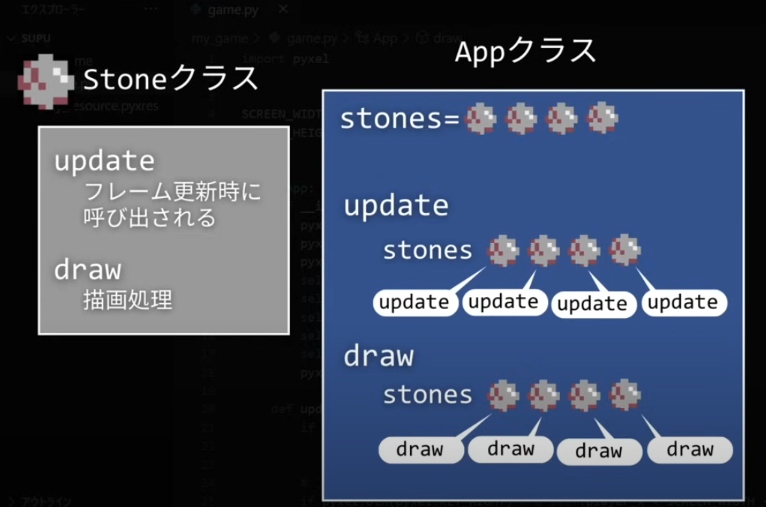

## 複数の石を落とす
Stoneクラスから作られたオブジェクトを落ちてくる一つ一つの石として扱う



```python
SCREEN_WIDTH = 160
SCREEN_HEIGHT = 120
STONE_INTERVAL = 30

石の座標を表すx,yインスタンス変数
class Stone:
  def __init__(self, x, y):
    self.x = x
    self.y = y
石の移動
  def update(self):
    if self.y < SCREEN_HEIGHT:
      self.y += 1
石の表示 
  def draw(self):
    pyxel.blt(self.x,self.y,0,8,0,8,8, pyxel.COLOR_BLACK)

class App:
  def __init__(self):
    pyxel.init(SCREEN_WIDTH,SCREEN_HEIGHT,title='サプーゲーム')
    pyxel.mouse(True)
    pyxel.load("my_resource.pyxres")
    self.player_x = SCREEN_WIDTH // 2
    self.player_y = SCREEN_HEIGHT * 4 // 5

Stoneクラスに持たせた石のx座標とy座標削除
stoneオブジェクトを複数持っているstonesをインスタンス変数として定義
    # self.stone_x = SCREEN_WIDTH // 2
    # self.stone_y = 0
    self.stones = []
    self.is_collision = False
    pyxel.run(self.update, self.draw)

  def update(self):
    if pyxel.btnp(pyxel.KEY_ESCAPE):
      pyxel.quit()

    if pyxel.btn(pyxel.KEY_RIGHT) and self.player_x < SCREEN_WIDTH - 12:
      self.player_x += 1
    elif pyxel.btn(pyxel.KEY_LEFT) and self.player_x > -4:
      self.player_x -= 1

石を追加(instance変数stonesリストにstoneオブジェクト追加)
self.stonesにStoneオブジェクトを追加(1秒に1つずつ追加)
pyxel.frame_count　← 経過フレーム数を自動格納した変数、ゲームを始めてからどのくらいフレーム更新されたか
この値を30で割った余りが0なら1秒ずつstonesにstone objectを追加する
pyxel.rndi(最小値,最大値)
    if pyxel.frame_count % STONE_INTERVAL == 0:
      self.stones.append(Stone(pyxel.rndi(0, SCREEN_WIDTH - 8), 0))

stonesに入っている石を全て動かす処理
forでstone objectのupdateメソッドを呼び出す
copyメソッドでstonesをコピーしたオブジェクトを指定
    for stone in self.stones.copy():
      stone.update()
衝突
      if (self.player_x <= stone.x <= self.player_x + 8 and self.player_y <= stone.y <= self.player_y + 8):
        self.is_collision = True

画面外に出た石を削除
      if stone.y >= SCREEN_HEIGHT:
        self.stones.remove(stone)

一つの石を動かしていた処理を削除
      # if self.stone_y < SCREEN_HEIGHT:
      #   self.stone_y += 1

def draw(self):
    pyxel.cls(pyxel.COLOR_DARK_BLUE)
    for stone in self.stones:
      stone.draw()
石の表示削除
    # pyxel.blt(self.stone_x,self.stone_y,0,8,0,8,8, pyxel.COLOR_BLACK)
    pyxel.blt(self.player_x, self.player_y, 0,16,0,16,16, pyxel.COLOR_BLACK)
```


ReadMe.md ファイルを開いているときに、「Command + Shift + P」を押して、上のコマンドパレットに 「Markdown: Open Preview to the Side」と入力し選択すると、右側にマークダウンのプレビューを表示することができます。

<p align="center"><a href="https://laravel.com" target="_blank"></a></p>

<p align="center">
<a href="https://github.com/laravel/framework/actions"></a>
<a href="https://packagist.org/packages/laravel/framework"></a>
<a href="https://packagist.org/packages/laravel/framework"></a>
<a href="https://packagist.org/packages/laravel/framework"></a>
</p>

## About Laravel

Laravel is a web application framework with expressive, elegant syntax. We believe development must be an enjoyable and creative experience to be truly fulfilling. Laravel takes the pain out of development by easing common tasks used in many web projects, such as:

- [Simple, fast routing engine](https://laravel.com/docs/routing).
- [Powerful dependency injection container](https://laravel.com/docs/container).
- Multiple back-ends for [session](https://laravel.com/docs/session) and [cache](https://laravel.com/docs/cache) storage.
- Expressive, intuitive [database ORM](https://laravel.com/docs/eloquent).
- Database agnostic [schema migrations](https://laravel.com/docs/migrations).
- [Robust background job processing](https://laravel.com/docs/queues).
- [Real-time event broadcasting](https://laravel.com/docs/broadcasting).

Laravel is accessible, powerful, and provides tools required for large, robust applications.

## Learning Laravel

Laravel has the most extensive and thorough [documentation](https://laravel.com/docs) and video tutorial library of all modern web application frameworks, making it a breeze to get started with the framework.

You may also try the [Laravel Bootcamp](https://bootcamp.laravel.com), where you will be guided through building a modern Laravel application from scratch.

If you don't feel like reading, [Laracasts](https://laracasts.com) can help. Laracasts contains over 2000 video tutorials on a range of topics including Laravel, modern PHP, unit testing, and JavaScript. Boost your skills by digging into our comprehensive video library.

## Laravel Sponsors

We would like to extend our thanks to the following sponsors for funding Laravel development. If you are interested in becoming a sponsor, please visit the Laravel [Patreon page](https://patreon.com/taylorotwell).

### Premium Partners

- **[Vehikl](https://vehikl.com/)**
- **[Tighten Co.](https://tighten.co)**
- **[Kirschbaum Development Group](https://kirschbaumdevelopment.com)**
- **[64 Robots](https://64robots.com)**
- **[Cubet Techno Labs](https://cubettech.com)**
- **[Cyber-Duck](https://cyber-duck.co.uk)**
- **[Many](https://www.many.co.uk)**
- **[Webdock, Fast VPS Hosting](https://www.webdock.io/en)**
- **[DevSquad](https://devsquad.com)**
- **[Curotec](https://www.curotec.com/services/technologies/laravel/)**
- **[OP.GG](https://op.gg)**
- **[WebReinvent](https://webreinvent.com/?utm_source=laravel&utm_medium=github&utm_campaign=patreon-sponsors)**
- **[Lendio](https://lendio.com)**

## Contributing

Thank you for considering contributing to the Laravel framework! The contribution guide can be found in the [Laravel documentation](https://laravel.com/docs/contributions).

## Code of Conduct

In order to ensure that the Laravel community is welcoming to all, please review and abide by the [Code of Conduct](https://laravel.com/docs/contributions#code-of-conduct).

## Security Vulnerabilities

If you discover a security vulnerability within Laravel, please send an e-mail to Taylor Otwell via [taylor@laravel.com](mailto:taylor@laravel.com). All security vulnerabilities will be promptly addressed.

## License

The Laravel framework is open-sourced software licensed under the [MIT license](https://opensource.org/licenses/MIT).
